# 🎓 Automated E-Learning Data Pipeline

End-to-end data engineering project — from raw course scraping to an analytics-ready Star Schema powered by **dbt**, **DuckDB/Fabric**, and **Power BI**.

---

## Architecture

### Local Solution
```
Raw CSV Files (Web Scrapers)
            ↓
   DuckDB Local Warehouse
            ↓
        dbt Models
  Staging → Intermediate → Snapshot → Marts
            ↓
     Power BI / SQL Queries
```

### Cloud Solution
```
Raw Course Data (Scraped CSVs)
            ↓
   Fabric Notebook1 (Ingestion)
   Load → Fabric Warehouse (Lakehouse)
            ↓
   dbt Fabric Data Build Tool
  Staging → Intermediate → Snapshot → Marts
            ↓
   Power BI Semantic Model & Dashboard
```

---

## 🛠 Stack

| Layer           | Local          | Cloud            |
|-----------------|----------------|------------------|
| Orchestration   | Apache Airflow | Microsoft Fabric |
| Storage         | DuckDB         | Fabric Warehouse |
| Transformation  | dbt-duckdb     | dbt (Fabric Job) |
| Data Quality    | 73+ dbt tests  | 73+ dbt tests    |
| Dashboard       | SQL / BI tool  | Power BI         |

---

## 📊 Data Model

**Star Schema** with 8 dimensions + 1 fact table:

```
                  dim_platform
                       │
              dim_domain─┼─dim_level
                       │
   dim_instructor──fact_offerings──dim_offering_type
         │              │              │
    dim_date       dim_language   dim_offering (SCD2)
```

**Dimensions:** platform, domain, level, language, instructor, offering_type, date, offering  
**Fact Table:** fact_offerings (price, rating, reviews, enrollment, duration, derived metrics)

---

## 📁 Project Structure

```
Automated_E-Learning_Data_Pipeline/
├── README.md
├── docs/
│   ├── Technical_Documentation.pdf
│   ├── Cloud_Pipeline_Documentation.pdf
│   ├── User_Manual.pdf
│   ├── Data_Flow_System_Behavior.pdf
│   └── screenshots/
├── local_solution/
│   ├── airflow_home/
│   │   ├── docker-compose.yml
│   │   ├── dags/
│   │   │   └── course_data_pipeline.py
│   │   └── dbt/
│   │       ├── models/
│   │       │   ├── staging/
│   │       │   ├── intermediate/
│   │       │   └── marts/
│   │       ├── snapshots/
│   │       ├── macros/
│   │       ├── dbt_project.yml
│   │       └── packages.yml
│   └── README.md
├── cloud_solution/
│   ├── dbt_project.yml
│   ├── models/
│   ├── snapshots/
│   ├── macros/
│   ├── Pipelining/
│   │   └── Pipelining.json
│   ├── PowerBI_Dashboard.pbix
│   └── README.md
└── data/
    └── seed_data/
```

---

## 🔄 ETL Flow

| Step          | Description                                    |
|---------------|------------------------------------------------|
| **Extract**   | Scrape Coursera, Udemy, Udacity (CSV/API)      |
| **Load**      | Store raw data → DuckDB/Fabric Warehouse       |
| **Stage**     | `stg_coursera`, `stg_udemy`, `stg_udacity`     |
| **Combine**   | `int_courses_combined` → union 3 platforms     |
| **Standardize** | `int_courses_standardized` → business logic   |
| **Snapshot**  | `offering_snapshot` → SCD Type 2 history       |
| **Marts**     | 8 dims + fact_offerings → star schema          |
| **Test**      | 73+ dbt tests → data quality validation        |
| **Serve**     | Power BI reads → interactive dashboard         |

---

## 🌱 Seeds

Load raw CSV files into DuckDB:

```bash
dbt seed --project-dir local_solution/airflow_home/dbt \
         --profiles-dir local_solution/airflow_home/dbt
```

**Files loaded:**
- `coursera_final_data.csv` (8,205 rows)
- `udacity_final_data.csv` (485 rows)
- `udemy_final_data.csv` (22,6180 rows)

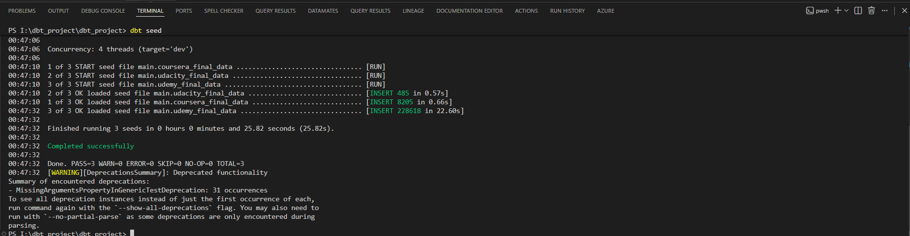

---

## 📐 Data Modeling

**Kimball Star Schema** optimized for BI and recommendation systems.

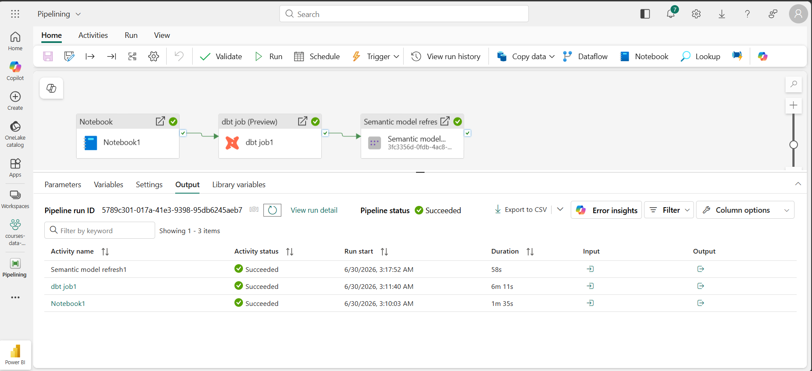

---

## ▶️ dbt Run

Build all models in dependency order:

```bash
dbt run --project-dir local_solution/airflow_home/dbt \
        --profiles-dir local_solution/airflow_home/dbt
```

**Models executed:**
- 3 staging views
- 2 intermediate views
- 1 snapshot (SCD Type 2)
- 8 dimension tables
- 1 fact table

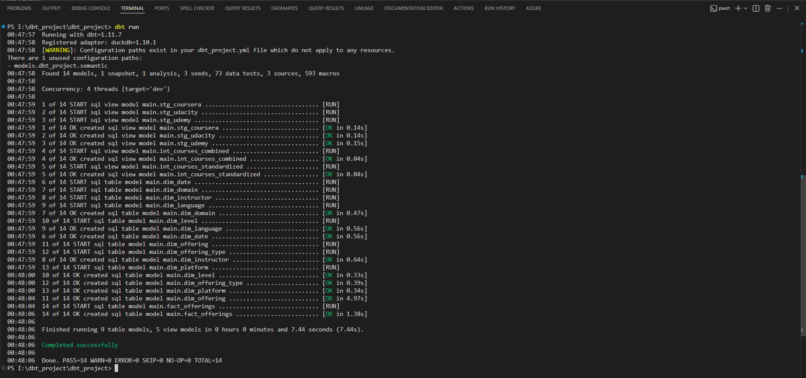

---

## 🧪 dbt Tests

**73+ automated tests** covering data quality:

| Test Type | Count | Examples |
|-----------|-------|----------|
| `not_null` | 25+ | platform, title, course_id |
| `unique` | 20+ | course_id, dim_offering_sk |
| `accepted_values` | 15+ | platform, level, price_category |
| `relationships` | 10+ | fact_offerings → dim_* |
| `range_checks` | 3+ | rating (0-5), price (>0) |

```bash
dbt test --project-dir local_solution/airflow_home/dbt \
         --profiles-dir local_solution/airflow_home/dbt
```

**Result:** ✅ 73 tests PASSED

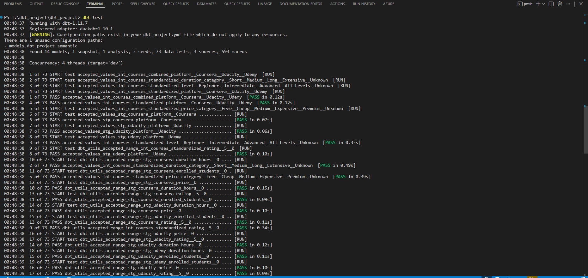
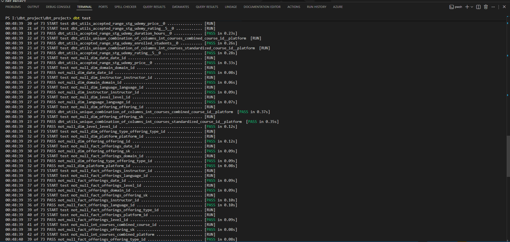
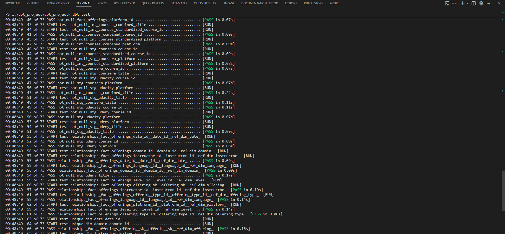
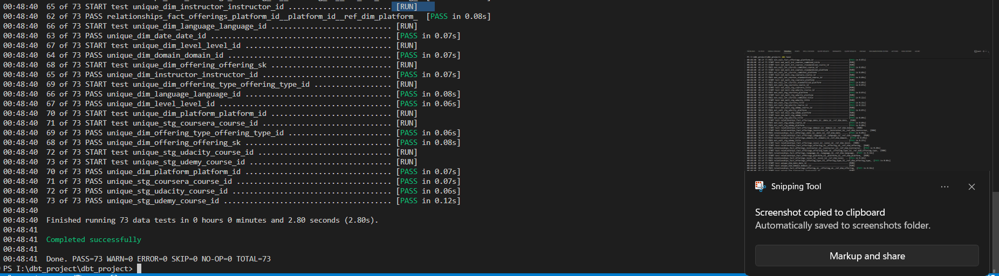

---

## 🕸 dbt Lineage Graph

View data lineage and dependencies:

```bash
dbt docs generate --project-dir local_solution/airflow_home/dbt \
                  --profiles-dir local_solution/airflow_home/dbt

dbt docs serve
```

**Lineage shows:**
- Raw sources → staging → intermediate → snapshot → marts
- All transformations and dependencies
- Data flow from 3 platforms → unified star schema

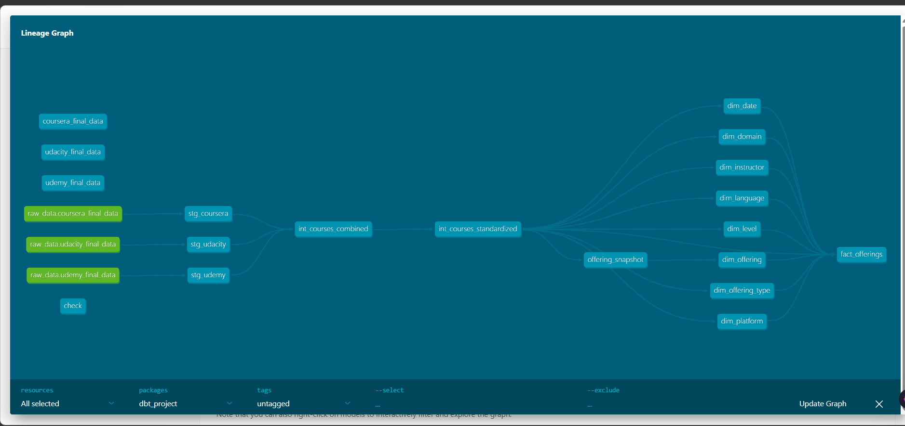

---

## 📊 Dashboard

**Power BI** dashboard connected directly to warehouse.

**Features:**
- 📊 Course metrics (avg rating, total enrolled, cost per hour)
- 🎯 Filters: domain, level, platform, price category, duration
- 📈 Top courses ranked by quality and value
- 🌍 Cross-platform comparison
- 💰 Price and cost analysis

```
Open: PowerBI_Dashboard.pbix
```

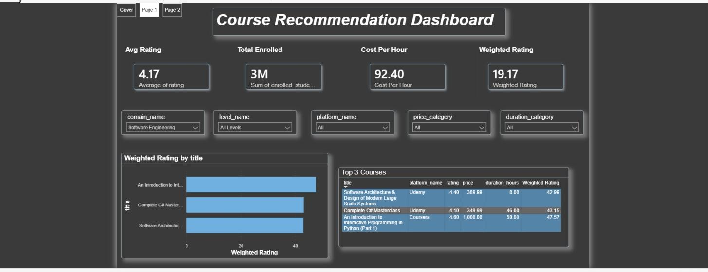
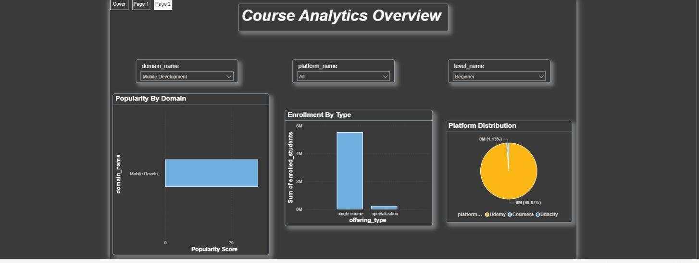

---

## 🌀 Orchestration with Airflow

**Local solution** orchestrated with Apache Airflow (Docker).

**DAG Tasks:**

```
validate_cookie → scrape_udemy → scrape_udacity → scrape_coursera
                                 ↓
                         align_and_copy_csvs
                                 ↓
                              dbt_deps
                                 ↓
                              dbt_seed
                                 ↓
                           dbt_snapshot
                                 ↓
                              dbt_run
                                 ↓
                              dbt_test
```

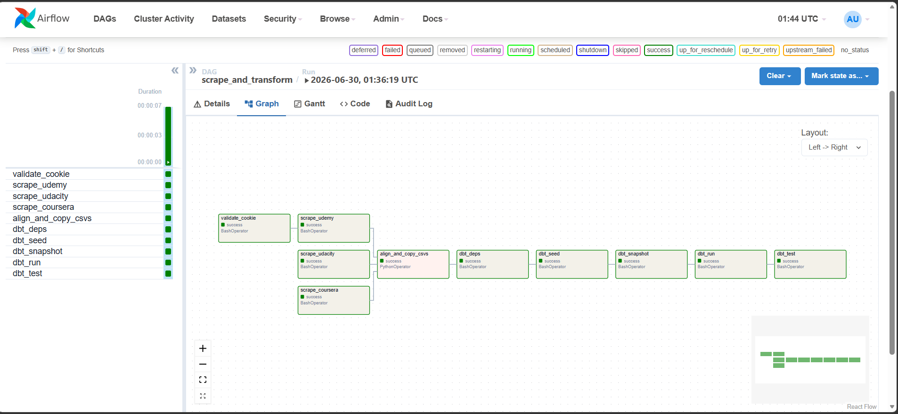

---

## ☁️ Cloud Pipeline (Fabric)

**Cloud solution** orchestrated with Microsoft Fabric.

**Pipeline Activities:**

```
Notebook1 (Ingestion)
    ↓
dbt job1 (Transformation)
    ↓
Semantic model refresh (Power BI)
    ↓
PowerBI_Dashboard (Live)
```


---

## 🚀 Quick Start

### Local Solution (Docker + Airflow + DuckDB)

**1. Clone the repository**
```bash
git clone https://github.com/Mahmoud-E-28/Automated_E-Learning_Data_Pipeline.git
cd Automated_E-Learning_Data_Pipeline
```

**2. Start Airflow with Docker**
```bash
cd local_solution/airflow_home
docker compose up -d
```

**3. Open Airflow UI**
```
http://localhost:8080
Login: airflow / airflow
```

**4. Trigger the DAG**
- Find `course_data_pipeline`
- Click toggle to unpause
- Click play button → Trigger DAG

**5. Monitor progress**
- Green = success
- Red = failed
- Check logs for errors

**6. Query results**
```bash
duckdb dbt_local.duckdb
SELECT * FROM fact_offerings LIMIT 10;
```

---

### Cloud Solution (Microsoft Fabric + Power BI)

**1. Open Fabric workspace**

Navigate to your Fabric workspace with the "Pipelining" pipeline.

**2. Trigger the pipeline**
```
Click "Run" button
```

**3. Monitor activities**
- Notebook1 (ingestion) → ✅ Succeeded
- dbt job1 (transformation) → ✅ Succeeded
- Semantic model refresh → ✅ Succeeded

**4. View Power BI dashboard**
```
Open: PowerBI_Dashboard.pbix
```

---

## 📈 Results

| Metric | Value |
|--------|-------|
| **Platforms unified** | 3 (Coursera, Udemy, Udacity) |
| **Total courses** | 31,308 |
| **Dimensions** | 8 |
| **Facts** | 1 |
| **dbt tests** | 73+ |
| **Test pass rate** | 100% ✅ |
| **Pipeline duration** | ~7.5 min (local) / ~8 min (cloud) |
| **Last run** | 6/30/2026, 3:17 AM |

---

## 📚 Documentation

| Document | Purpose |
|----------|---------|
| [Technical Doc](./documents/presentation/Technical_Documentation.pdf) | Architecture, dbt layers, schema |
| [Cloud Setup](./documents/presentation/Cloud_Pipeline_Documentation.pdf) | Fabric deployment guide |
| [User Manual](./documents/presentation/User_Manual.pdf) | How to run pipelines |
| [Data Flow](./documents/presentation/Data_Flow_System_Behavior.pdf) | DFDs, sequence diagrams |
| [Proposal](./documents/presentation/Project_Proposal.pdf) | Business case, objectives |

---

## 🔧 Challenges & Solutions

| Challenge | Solution |
|-----------|----------|
| Inconsistent formats (3 platforms) | Standardization macros + intermediate layer |
| dbt dependency cycle | Linear DAG: deps → seed → snapshot → run → test |
| Course change tracking | SCD Type 2 snapshot (dbt_valid_from / dbt_valid_to) |
| Data quality | 73+ automated tests (not_null, unique, relationships) |
| Different pricing models | Normalized estimated_total_cost metric |
| Fail-fast pipeline | Sequential activities, no refresh on failure |

---

## 👥 Team

All **Data Engineers** building this project:

# Team Connections

| Name | LinkedIn |
| :--- | :--- |
| Mahmoud Ehab | [LinkedIn](https://www.linkedin.com/in/mahmoud-ehab-data) |
| Marwan Abdelmenuem | [LinkedIn](https://www.linkedin.com/in/marwan--abdelmenuem) |
| Amin Ashraf | [LinkedIn](https://www.linkedin.com/in/amin-ashraf) |
| Mariam Ibrahim | [LinkedIn](https://www.linkedin.com/in/mariam--ibrahim) |
| Yomna Mohamed | [LinkedIn](https://www.linkedin.com/in/yomna-mohamed-b357492a7) |
| Abdullah De | [LinkedIn](https://www.linkedin.com/in/abdullah-de) |

**Skills:** dbt | Airflow | DuckDB | Fabric | Power BI | SQL | Python | Data Modeling

---

## 📦 Tech Stack

**Data Processing:** dbt, SQL, Python  
**Databases:** DuckDB (local), Fabric Warehouse (cloud)  
**Orchestration:** Apache Airflow, Microsoft Fabric  
**BI:** Power BI  
**Infrastructure:** Docker, GitHub  
**Testing:** dbt tests, data quality validation  

---

## 🔗 Links

**GitHub:** [Mahmoud-E-28/Automated_E-Learning_Data_Pipeline](https://github.com/Mahmoud-E-28/Automated_E-Learning_Data_Pipeline)

**Repository Features:**
- ✅ Fully documented
- ✅ Production-ready
- ✅ 73+ data quality tests
- ✅ 2 deployment modes (Local + Cloud)
- ✅ 6 comprehensive guides
- ✅ 20+ architecture diagrams

---

## 🎯 Next Steps

- [ ] Automate scheduled scraping refresh
- [ ] Add ML feature engineering layer
- [ ] Build recommendation engine (LLM-based)
- [ ] Expand to more platforms
- [ ] Implement monitoring & alerting
- [ ] Add data lineage tracking (OpenMetadata)

---

## 📄 License

MIT License — see [LICENSE](./LICENSE) for details.

---

**Repository:** [Automated_E-Learning_Data_Pipeline](https://github.com/Mahmoud-E-28/Automated_E-Learning_Data_Pipeline)